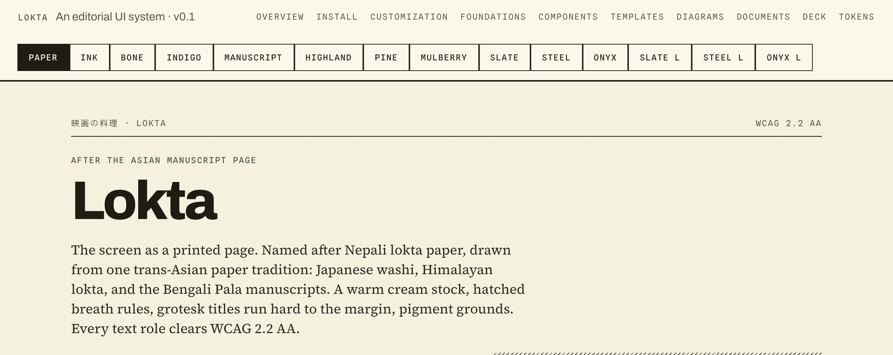
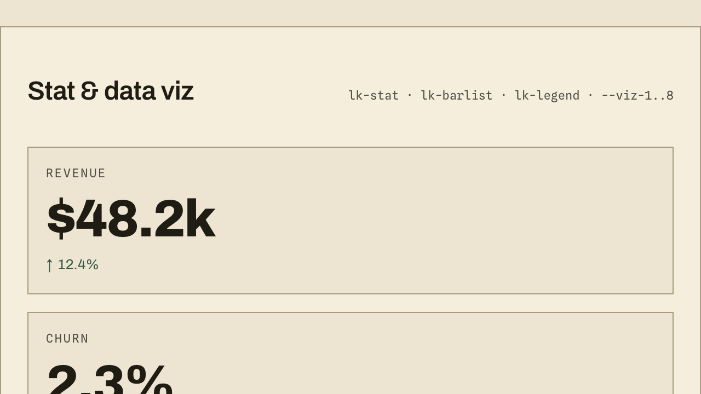
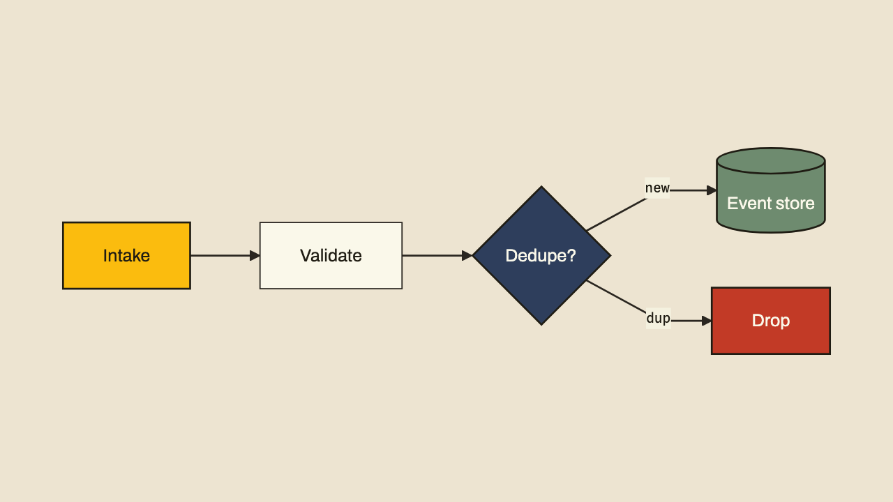
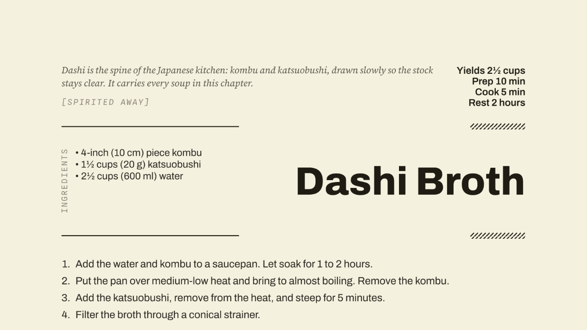
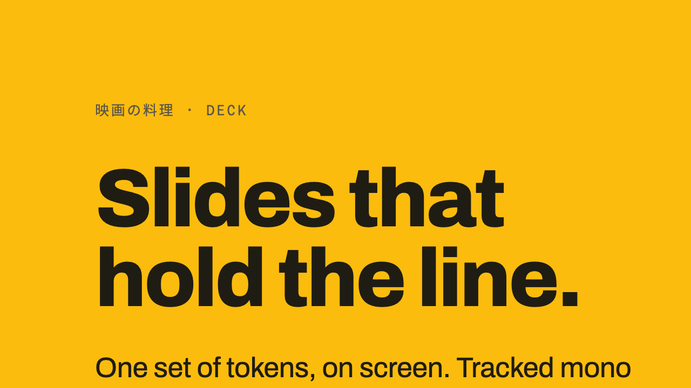

# Lokta

Lokta treats the screen as a printed page and holds every text role to WCAG 2.2
AA. It is named after Nepali lokta paper, the fibrous archival paper of the
Himalayas, and draws on one trans-Asian paper-and-manuscript tradition through
three references: the Japanese cookbook _Cuisine on Screen_ (Sachiyo Harada,
Prestel), Nepali lokta, and the Bengali Pala manuscripts behind Professor Siddika
Kabir's _Ranna Khaddo Pushti_. The grammar: a warm cream stock, a vertical
映画の料理 spine, hatched breath rules, heavy grotesk titles run hard to the
margin, tracked mono labels, and full-bleed pigment grounds.



It runs across surfaces from one set of tokens: web components, a Marp slide
theme, Typst document themes, and a Mermaid diagram theme.

|                                                    |                                                        |
| -------------------------------------------------- | ------------------------------------------------------ |
|           |  |
|  |         |

It is deliberately flat (layering from borders, not shadows) and hard-edged
(square caps, no rounded controls by default). It ships the way IBM ships Carbon:
tokens built through a pipeline into multiple formats, a slide theme, document
themes, templates, and a docs site on GitHub Pages.

- **Type:** Archivo (display and body), Spline Sans Mono (labels and figures),
  Source Serif 4 (pull quotes), and the script faces Noto Sans JP, Anek Bangla
  (Bengali), and Mukta and Martel (Devanagari). All SIL OFL, self-hosted.
- **Color:** warm paper surfaces, warm-tinted ink text, saturated pigment
  grounds. Marigold is the hero; the heritage dyes (madder, lac, turmeric) are
  Accent options.
- **Stocks:** Paper, Manuscript (aged-lokta ivory), Bone, Ink, Indigo, Highland
  (stone-cool dark), plus the enterprise set Slate, Steel, Onyx. Every text role
  clears WCAG 2.2 AA on each.

## Repos

This is the source and docs hub. Each surface also ships as its own standalone,
plug-and-play repo you can install on its own.

| Repo                                                      | What it is                                                 | Install                                    |
| --------------------------------------------------------- | ---------------------------------------------------------- | ------------------------------------------ |
| [lokta-css](https://github.com/msradam/lokta-css)         | Tokens, stocks, and component CSS, self-hosted fonts. | `npm install github:msradam/lokta-css`     |
| [lokta-marp](https://github.com/msradam/lokta-marp)       | Marp slide theme with per-slide Mermaid theming.           | `npm install github:msradam/lokta-marp`    |
| [lokta-typst](https://github.com/msradam/lokta-typst)     | Editorial document themes for Typst.                       | `git clone` + `node install.mjs`           |
| [lokta-mermaid](https://github.com/msradam/lokta-mermaid) | Mermaid diagram theme, web and print.                      | `npm install github:msradam/lokta-mermaid` |

This repo also builds the same surfaces as workspace packages under `packages/`
(`@lokta/tokens`, `@lokta/css`, `@lokta/marp-theme`, `@lokta/typst`,
`@lokta/mermaid`) and deploys the docs site to GitHub Pages.

## Install

The web layer, from its repo:

```
npm install github:msradam/lokta-css
```

```css
@import 'lokta-css/lokta.css';
```

Or zero install, straight from the CDN:

```html
<link rel="stylesheet" href="https://cdn.jsdelivr.net/gh/msradam/lokta-css@main/lokta.css" />
```

Diagrams:

```html
<script type="module">
  import mermaid from 'https://cdn.jsdelivr.net/npm/mermaid@11/dist/mermaid.esm.min.mjs';
  import { initLoktaMermaid } from 'https://cdn.jsdelivr.net/gh/msradam/lokta-mermaid@main/index.mjs';
  initLoktaMermaid(mermaid);
</script>
```

Slides and documents: see [lokta-marp](https://github.com/msradam/lokta-marp) and
[lokta-typst](https://github.com/msradam/lokta-typst).

## Consume a theme

Load a token theme (it defines the semantic variables), then the components, then
set the stock with `data-theme` on the root element. Paper is the default.

```css
/* all stocks in one file */
@import '@lokta/tokens/css/lokta.css';
@import '@lokta/css/lokta.css';
```

Or load a single stock:

```css
@import '@lokta/tokens/css/lokta.paper.css';
@import '@lokta/css/lokta.css';
```

```html
<html data-theme="ink">
  <body class="lk">
    <button class="lk-btn lk-btn-primary">Action</button>
  </body>
</html>
```

Build UI against the semantic layer (`--text-primary`, `--surface-page`,
`--border-strong`, `--accent-success`, and so on) so theming and accessibility
are inherited. Never consume primitives (`--ink-90`, `--paper-01`) directly in
product UI.

### Brand customisation

Six range-limited dials. Everything else (type scale, 8px grid, AA rules,
component structure, hard-edged character) is locked. See
[CUSTOMIZATION.md](CUSTOMIZATION.md).

| Dial    | How                                    | Default     |
| ------- | -------------------------------------- | ----------- |
| Stock   | `data-theme`                           | paper       |
| Accent  | `--lk-accent` (curated pigments)       | marigold    |
| Voice   | `--font-family-*` (named faces)        | Archivo set |
| Density | `data-density="compact"`               | comfortable |
| Radius  | `--lk-radius` (0 to 3px)               | `0px`       |
| Grain   | `data-grain` (off / subtle / fibrous)  | subtle      |

Script (Latin, Devanagari, Bengali, CJK) is chosen by content language via
`:lang()`, not a dial.

## Build

Requires Node 20 or newer.

```
npm install
npm run build:tokens   # Style Dictionary -> packages/tokens/dist, then verify vs the reference
npm run build:site     # static docs into site/
npm run build:deck     # render the Marp deck to HTML and PDF (needs Chrome/Chromium)
```

`npm run build` runs tokens, css (vendors fonts), and site in order. The token
pipeline reads `tokens/lokta.tokens.json`, splits it into `tokens/sets/`, and
builds per-stock CSS, SCSS, and JS. The split and verify steps:

```
npm run split:tokens   # regenerate tokens/sets/ from the canonical JSON
npm run fonts          # vendor the SIL OFL woff2 files
```

## Fonts

The woff2 files are vendored under each package's `fonts/` directory. The system
does not hot-link the Google Fonts CDN in production: that sends visitor IPs to
Google, a GDPR exposure in the EU. Run `npm run fonts` to re-fetch them.

## Documentation site

The docs site (overview, foundations, components, tokens reference, theme
switcher, embedded deck) builds into `site/` and deploys to GitHub Pages via
`.github/workflows/build-and-deploy.yml`. To publish: in the repository settings,
enable Pages with Source set to GitHub Actions, then push to `main`. The live URL
is shown in the workflow's deploy step and in Settings, Pages.

## Token architecture

1. **Primitives.** Raw values (`paper.01`, `ink.80`, `pigment.marigold`). Never
   consumed directly in product UI.
2. **Semantic.** Role aliases (`text.primary`, `surface.page`, `border.strong`,
   `accent.success`, `field.bg`, `focus.ring`).
3. **Stocks.** Each stock re-points the semantic layer, so theming and AA are
   inherited by anything built on the semantic tokens.

## Credits and prior art

Lokta is an interpretation of one paper-and-manuscript tradition, not a
reproduction of any source. It ships no text, photography, or artwork from them.

- **Nepali lokta paper.** The namesake: handmade bark paper of the Himalayas,
  used for a thousand years to carry Buddhist sacred texts. The Manuscript and
  Highland stocks, the fibre grain, and the deckle and palm-leaf motifs.
- _Cuisine on Screen_, Sachiyo Harada (Prestel, 2024). The structural language:
  the cream stock, the 映画の料理 spine, the hatched breath rules, the
  right-aligned grotesk display, and marigold as the full-bleed ground.
- _Ranna Khaddo Pushti_, Professor Siddika Kabir (1931 to 2012), and the Bengali
  Pala manuscripts behind it: the peach grounds, the heritage dye palette, and
  the Bengali type in Anek Bangla.

A typeface pairing and a layout grammar are not themselves copyrightable; the
books' contents are. Lokta borrows the former and none of the latter.

## License

MIT for the code and tokens. The bundled fonts are SIL OFL 1.1. See `LICENSE`.
