# @lokta/marp-theme

The Lokta presentation theme for [Marp](https://marp.app), with a sample deck.
Editorial slides: tracked mono labels, hatched end-marks, hard rules, and the
house pigment grounds.

## Use

In a deck's front matter, point Marp at the theme:

```markdown
---
marp: true
theme: lokta
---
```

When rendering with the CLI, pass the theme file and keep the `fonts/` directory
beside the output (font URLs resolve relative to the rendered HTML):

```
marp deck.md --theme lokta.marp.css -o deck.html
```

### Slide classes

Set a class on a slide with `<!-- _class: NAME -->`.

| Class      | Effect                                     |
| ---------- | ------------------------------------------ |
| `lead`     | Cover slide. Centered, oversized headline. |
| `invert`   | Ink dark stock.                            |
| `marigold` | Marigold feature ground (dark text).       |
| `peach`    | Peach heritage ground (dark text).         |

Inline helpers: a backtick `` `LABEL` `` on its own line renders as a tracked
eyebrow. On a pigment or dark ground use `<span class="label">LABEL</span>` so it
recolors with the ground.
`---` becomes the hatched end-mark divider. `>` blockquotes set in Source Serif.

### Layout classes

| Class      | Effect                                                              |
| ---------- | ------------------------------------------------------------------- |
| `lead`     | Cover slide. Centered, oversized headline.                          |
| `columns`  | Flows dense content into two columns; headings span the full width. |
| `divider`  | Section break: eyebrow, big title, a measured rule.                 |
| `stat`     | One oversized figure. Write `# 92%`, then a caption paragraph.      |

For an image-split slide, use Marp's native background directive rather than a
class: `` puts the image on one side and keeps text on
the other (`bg left`, `bg right`, with an optional `:width`). Add a small
citation with `<p class="source">Source: …</p>`.

## Build

From the repo root:

```
npm run fonts            # vendor the woff2 files into fonts/
npm run build:deck       # renders deck.html and lokta-deck.pdf
```

PDF rendering needs a Chromium or Chrome install (Marp drives it under the hood).

## Mermaid

The theme carries the `.mermaid` rules that give diagrams the Lokta look (square
nodes, ink strokes, mono edge labels). Two ways to get a diagram into a deck:

- Pre-render to SVG and embed it. Reliable in HTML and PDF, and what the example
  deck does (`lokta-pipeline.svg`):

  ```sh
  mmdc -c ../mermaid/lokta-mermaid.json -C ../mermaid/lokta-mermaid.print.css \
    -i diagram.mmd -o lokta-pipeline.svg
  ```

  ```markdown
  
  ```

- Live in an HTML deck. Render with `marp.config.mjs` (it turns ```mermaid fences
into `<div class="mermaid">`), then include mermaid and initialize it with
`@lokta/mermaid`:

  ```sh
  marp example-deck.md --config-file marp.config.mjs --theme lokta.marp.css -o deck.html
  ```

  Live diagrams render in the browser, not in PDF, so use the pre-rendered SVG
  when a deck must also export to PDF.

## Fonts

Self-hosted in `fonts/` (SIL OFL): Archivo, Spline Sans Mono, Source Serif 4,
Noto Sans JP. The theme does not hot-link the Google Fonts CDN, which would send
viewer IPs to Google (a GDPR exposure in the EU).

## License

MIT. Fonts are SIL OFL.
